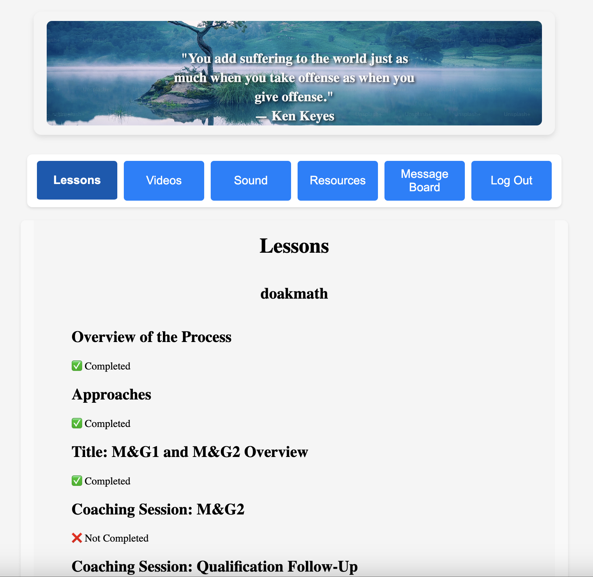
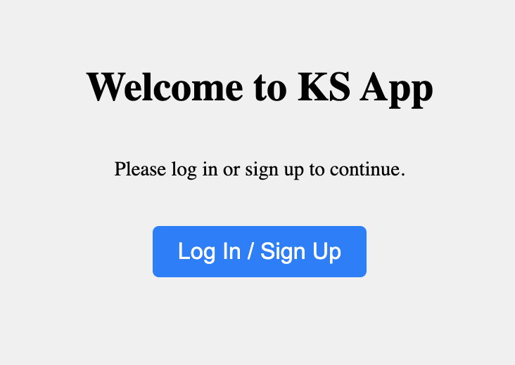
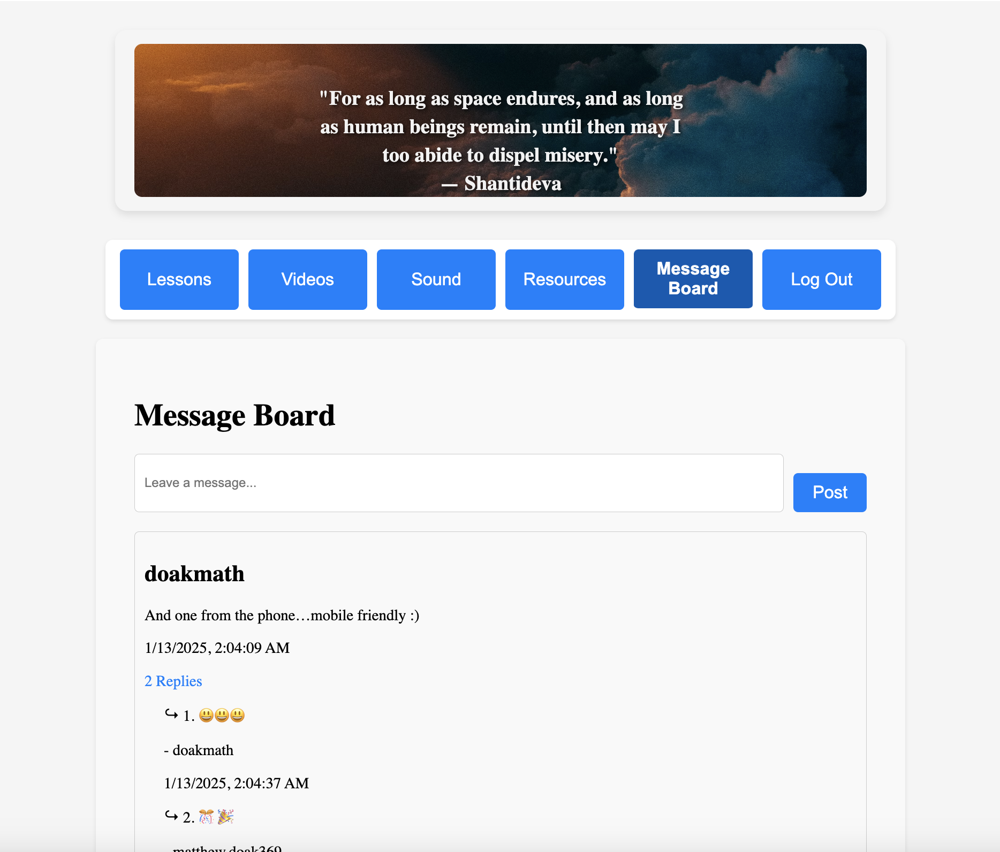

# KS App

The **KS App** is a polished and user-friendly web application that combines educational resources, user engagement tools, and an intuitive interface. This full-stack app is built with a React frontend and a Django backend and includes essential features like lessons, videos, sounds, and a dynamic message board. The app also integrates seamlessly with Auth0 for secure authentication.

## 🌟 **Key Features**
- **User Authentication**: Secure login and signup functionality using Auth0.
- **Lessons and Progress Tracking**: Users can view lessons and track their progress directly within the app.
- **Message Board**: A responsive message board where users can post comments and replies.
- **Random Quote Modal**: Displays a random motivational quote with a corresponding image upon login.
- **Video Library**: Users can access embedded videos directly in the app.
- **Responsive Design**: Optimized for both mobile and desktop devices.
- **Resource Library**: Easily accessible resources to support user learning.

## 🛠️ **Technologies Used**
### **Frontend**
- React
- Axios
- CSS for styling
- Auth0 for authentication

### **Backend**
- Django
- Django REST Framework (DRF)
- PostgreSQL

### **Deployment**
- **Frontend**: Deployed on Netlify
- **Backend**: Deployed on Render

## 🚀 **How to Run the Project Locally**

### **Backend Setup (Django)**
1. Clone the repository.
2. Navigate to the backend folder:
   ```bash
   cd backend
   ```
3. Create a virtual environment and activate it:
   ```bash
   python -m venv venv
   source venv/bin/activate   # On Windows, use `venv\Scripts\activate`
   ```
4. Install the required dependencies:
   ```bash
   pip install -r requirements.txt
   ```
5. Apply the migrations:
   ```bash
   python manage.py migrate
   ```
6. Run the server:
   ```bash
   python manage.py runserver
   ```

### **Frontend Setup (React)**
1. Navigate to the frontend folder:
   ```bash
   cd frontend
   ```
2. Install the dependencies:
   ```bash
   npm install
   ```
3. Start the development server:
   ```bash
   npm start
   ```

## 🔐 **Authentication with Auth0**
- Create an account on [Auth0](https://auth0.com/).
- Set up your application and get your `Client ID` and `Domain`.
- Configure the environment variables for both the frontend and backend.

## 🖼️ **Screenshots**

### **Lessons Page**


### **Welcome Page**


### **Message Board**


### **Quote Modal**


## 🌐 **Live Demo**
- **Frontend**: [Netlify Deployment](https://zesty-blini-1594ea.netlify.app/)
- **Backend**::
### Example Public API Endpoint
- **Random Quote API**: [https://ks-project.onrender.com/quotes/]

## 📂 **Project Structure**
```
KS App
├── backend
│   ├── manage.py
│   ├── mvp (Django app)
│   └── requirements.txt
├── frontend
│   ├── public
│   │   └── screenshots
│   ├── src
│   │   ├── components
│   │   └── App.js
│   └── package.json
└── README.md
```

## 📝 **Lessons Learned**
During the development of the KS App, I enhanced my skills in:
- Building full-stack applications
- Integrating third-party authentication systems
- Creating responsive and user-friendly UIs
- Debugging and deploying applications on different platforms

## 🤝 **Contributions**
Contributions are welcome! If you have any suggestions or improvements, feel free to fork the repo and create a pull request.

## 📧 **Contact**
For any questions or feedback, please reach out via the [GitHub Issues](https://github.com/your-repo/issues).

---
This project is a testament to the power of continuous learning and the impact of building something meaningful for users. Thank you for visiting!
